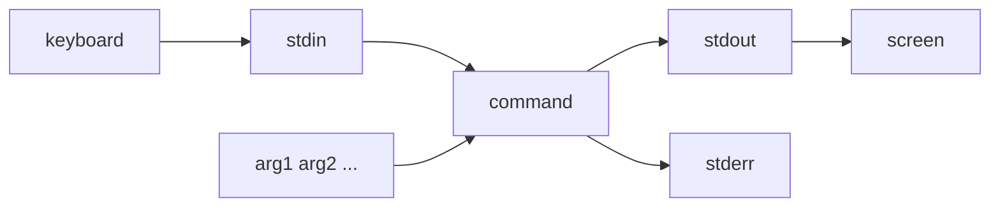
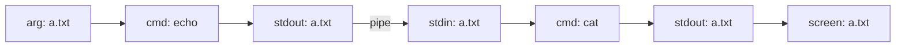
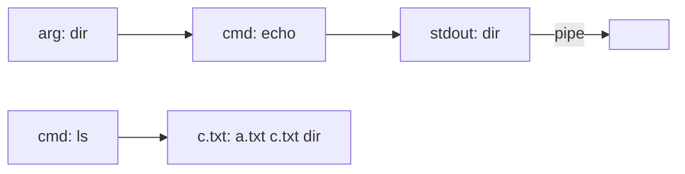

# Bash plumbing

If your working directory contains

> a.txt --> "foo" 
> dir 
> dir/b.txt --> "bar"
 
what happens when you run the following in Bash?

`echo a.txt | cat` 
`echo dir | ls > c.txt` 
`cat < a.txt | xargs cat`

The examples are silly. But they test your mental model of Bash plumbing: how data flows through Bash.

I was confused about Bash plumbing for a while but I think I've got things straight now. This post describes my mental model.

## A typical case

A command has two input sources: stdin and an array of arguments. And it has two output targets: stdout and stderr.

Stdin, stdout, and stderr are file-like: they can be read from and written to.

When you run a command, the command reads stdin and also looks at its arguments, does something, then writes something to stdout if the command was successful or else writes an error message to stderr.

Where does stdin get its content from? Whatever you type at the keyboard during particular periods. For example, run `grep blah`. Whatever you now type at the keyboard is written to stdin, continuing until you type ^d.

Where do stdout and stderr send their contents to? If the command was successful, stdout sends its content to the screen and stderr sits quietly. Else, the reverse.

Distinguish stdin and arguments. When you run `grep blah` then type 'my_file.txt', you've provided 'blah' as an argument and written 'my_file.txt' to stdin.

## Kinds of command

The previous section describes how a typical command works. But many commands work a bit differently.

For example:

  - `echo` doesn't read stdin
  - `cat` doesn't read stdin if filenames are given as arguments
  - `echo` and `cat` can run without any arguments
  - `rm` doesn't read stdin and without any options doesn't write to stdout

In such cases the picture above isn't quite right: it needs to be pruned.

## Pipe, redirects, and xargs

Things can get more complicated.

For example:

  - the pipe operator `cmd1 | cmd2` feeds `cmd1`'s stdout into `cmd2`'s stdin
  - the redirect `cmd < my_file.txt` makes `cmd` read from my_file.txt instead of stdin
  - the redirect `cmd > my_file.txt` makes `cmd` write to my_file.txt instead of stdout
  - `xargs cmd` tokenizes stdin and sends each token in turn as an argument to `cmd`

And of course these can be mixed and matched in confusing ways, as in our original examples. Still, by building on the picture above it's easy enough to work out what will happen.

Let's put that claim to the test.

## Back to the examples

### First example

`echo a.txt | cat`

### Second example

`echo dir | ls > c.txt`

Because `ls` doesn't read stdin, the pipe leads nowhere. Also, we haven't given `ls` any arguments so it lists the contents of the working directory. The file c.txt is created before `ls` executes and is written to instead of stdout. Each filename is actually written on a separate line, contrary to the picture.

### Third example

`cat < a.txt | xargs cat`

Really, 'cat' is one of `xargs`'s arguments. So the diagram is not strictly correct. But I think it's helpful to draw it this way. Also, if a.txt consists of multiple tokens, not just one, then each token in turn is provided as an argument to `ls`.